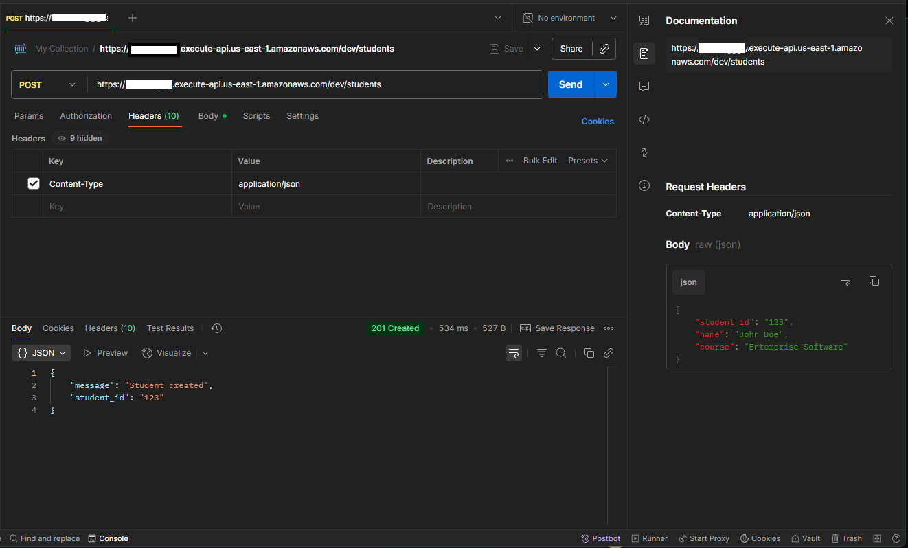
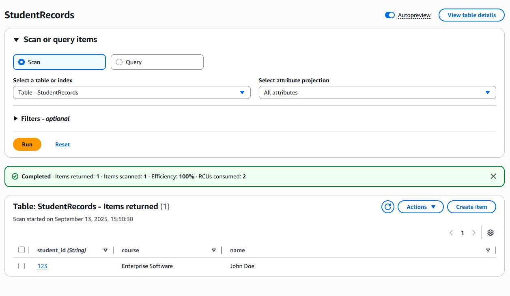
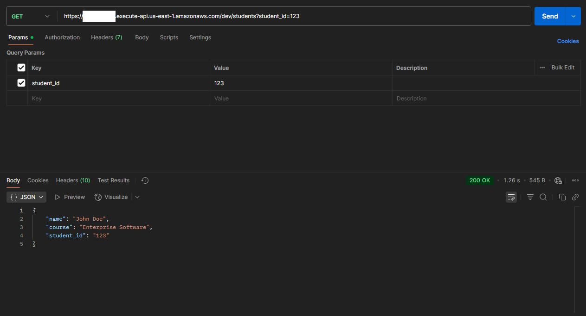
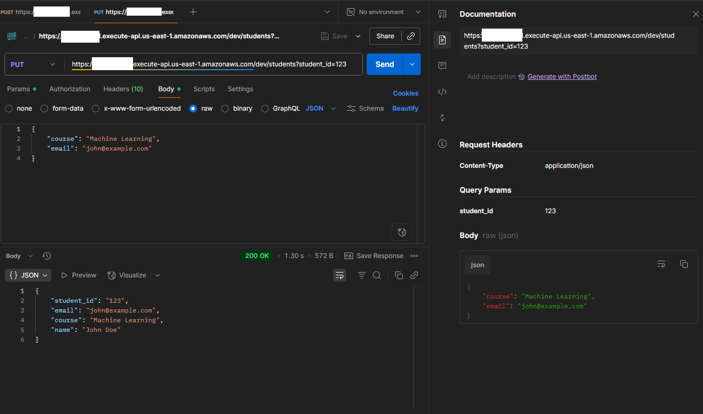
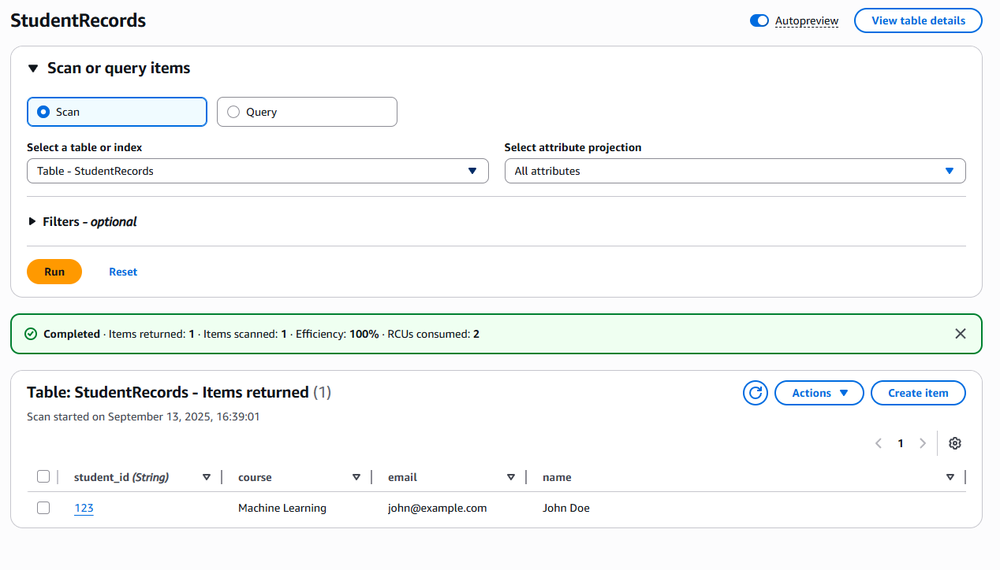
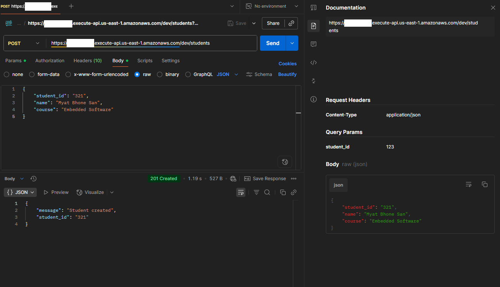
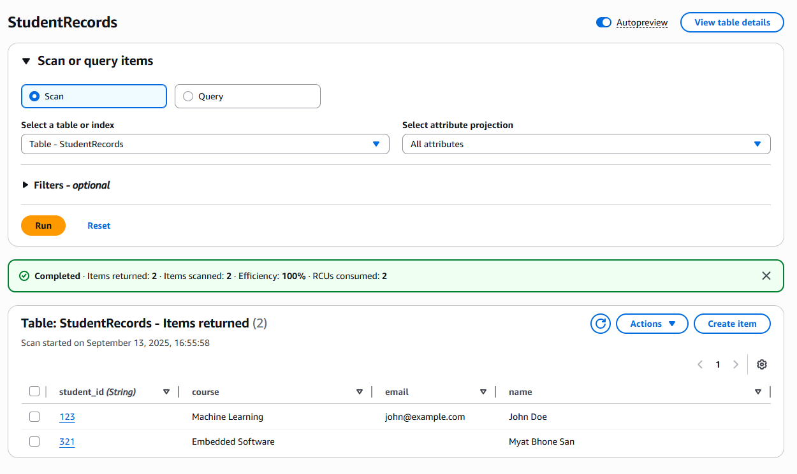
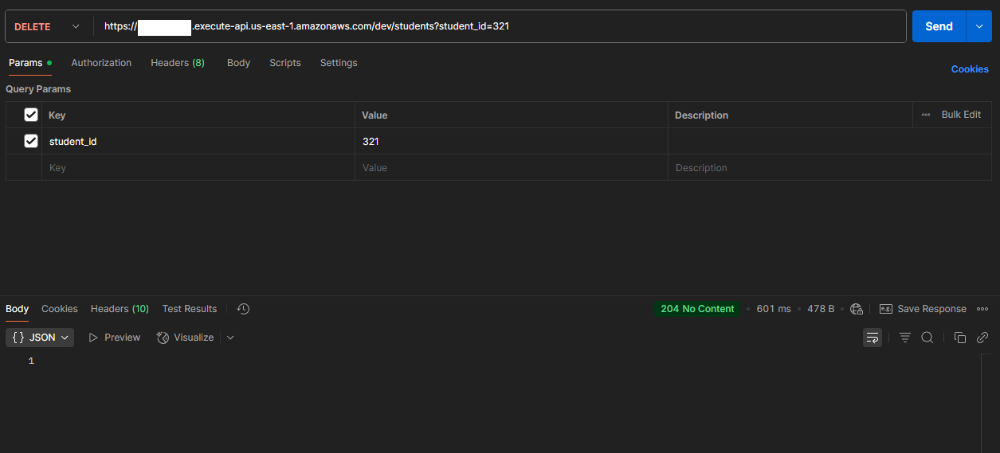

# Serverless Web Application
Creating a simple serverless web application using AWS Lambda and Amazon DynamoDB as the database service.
## POST Request
### Using Postman to send a POST Request

### DynamoDB table with new student record

## GET Request
### In Postman

## PUT Request
### Updating a student record with a PUT request in Postman

### DynamoDB with updated student record

## DELETE Request
### Making a student record to be deleted first

### DynamoDB with new student record

### Deleting the student

### Now the DynamoDB no longer has the student record with ID 321
