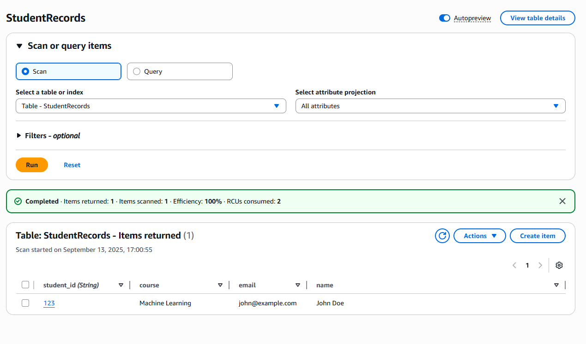

# Serverless Web Application
Creating a simple serverless web application using AWS Lambda and Amazon DynamoDB as the database service.
## POST Request
### Using Postman to send a POST Request

### DynamoDB table with new student record

## GET Request
### In Postman

## PUT Request
### Updating a student record with a PUT request in Postman

### DynamoDB with updated student record

## DELETE Request
### Making a student record to be deleted first

### DynamoDB with new student record

### Deleting the student

### Now the DynamoDB no longer has the student record with ID 321

## Reflection
Completing the “Serverless Web Application with AWS Lambda and DynamoDB” assignment was an eye‑opening experience. The biggest hurdle was getting comfortable with the AWS Management Console. The sheer number of services and the depth of configuration options can be overwhelming, especially when you’re new to the platform. I spent a fair amount of time asking ChatGPT and reading AWS docs to troubleshoot the problems

Setting up IAM roles and permissions turned out to be the most delicate part of the project. At first, my Lambda function kept failing with “AccessDenied” errors because I hadn’t granted it the dynamodb:PutItem, GetItem, UpdateItem, and DeleteItem actions. I also had to attach a policy that allowed the Lambda execution role to invoke the API Gateway. Once I created a managed policy with the necessary permissions and attached it to the Lambda’s execution role, the errors disappeared. I learned the importance of the principle of least privilege: starting with a minimal set of permissions and only adding what’s necessary as the function evolves.

Despite the rough start, the hands‑on process clarified how serverless components interact in a real‑world scenario. Building the API routes in API Gateway, mapping them to the Lambda integration, and then using Postman to test CRUD operations gave me a solid understanding of how the pieces fit together. I now feel more confident navigating the AWS Console and configuring IAM roles for future projects.